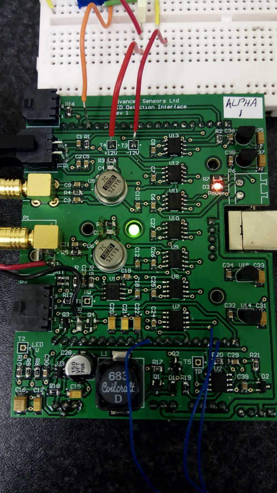

## Hardware and usage

The *USB-1208FS-Plus* is an analog input and digital I/O data acquisition device, produced by *Measurement Computing*.

[User guide PDF](https://www.mccdaq.com/PDFs/Manuals/usb-1208fs.pdf)

I helped to produce a custom PCB which attaches on top of the DAQ device. The board uses digitally controlled potentiometers and peripherals such as a high power LED, Laser, PMT(Photomultiplier tube) and more. I then wrote a few programs to interface with and control the hardware which was accomplished using programming libraries from the DAQ manufacturer. This allowed data to be captured, processed, logged and then plotted on graphs.

